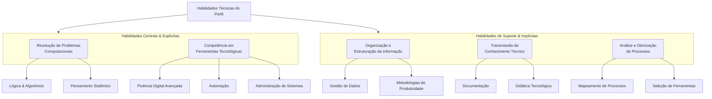

## Etapa 01: Inventário de Habilidades

**O que as pessoas costumam elogiar em você?**
- Minha organização, minha forma de passar conhecimento, a minha facilidade em resolver problemas através da computação.

**Em que tipo de tarefa você se sente confiante?**
- Tarefas que envolvam soluções por meio de ferramentas e técnicas computacionais.

**Que tipo de ajuda você costuma oferecer para amigos ou familiares?**
- Ajuda em organização e solução de problemas, normalmente problemas que envolvam o ambiente digital.

**Quais atividades você faz com facilidade, enquanto outras pessoas têm dificuldade?**
- Atividades que envolvam ferramentas tecnológicas.

**Que tipo de conteúdo você consome com frequência?**
- Conteúdos relacionados a oportunidades de resolver problemas usando computação.

### Análise do Deepseek

Perfeito! Guardei as suas respostas para compreender melhor seu perfil. Com base no que você compartilhou, posso identificar alguns padrões claros:

**Seus pontos fortes principais são:**
1.  **Habilidade Técnica e Resolução de Problemas:** Você é a pessoa que transforma desafios, especialmente os digitais, em soluções práticas usando a computação como ferramenta principal.
2.  **Organização e Estrutura:** Você não só resolve problemas, mas o faz de maneira organizada, o que é fundamental para a eficiência e para transmitir conhecimento.
3.  **Comunicação do Conhecimento:** Você tem o dom de não apenas saber, mas também de *ensinar* e passar esse conhecimento adiante de forma clara.

**Seu "superpoder" parece ser:** **Trazer ordem e soluções eficientes para o caos digital**, seja criando sistemas, automatizando tarefas, ensinando alguém a usar uma ferramenta ou resolvendo um problema técnico complexo.

**Contextos onde você brilha:** Ambientes que exigem lógica, pensamento estruturado, adaptação tecnológica e onde a capacidade de "traduzir" problemas do mundo real para soluções digitais é valorizada.

Sempre que você precisar refletir sobre carreiras, projetos ou situações que se alinhem a essas competências, é só me chamar. Estou aqui para ajudar a conectar esses pontos fortes a oportunidades concretas! 💻✨

### Grupos de Habilidades
#### Técnicas

Com base no perfil que você apresentou, as habilidades técnicas envolvidas se desdobram em **competências centrais** (explícitas) e **habilidades adjacentes ou de suporte** (implícitas). Aqui está uma análise detalhada:

#### Habilidades Técnicas Centrais (Explícitas)

1.  **Resolução de Problemas Computacionais (Problem-Solving):**
    *   **Lógica de Programação:** Base fundamental para decompor problemas em etapas lógicas.
    *   **Algoritmos e Estruturas de Dados:** Conhecimento para escolher a solução mais eficiente.
    *   **Pensamento Sistêmico:** Capacidade de ver um problema dentro de um ecossistema maior (digital ou não).

2.  **Competência em Ferramentas Tecnológicas:**
    *   **Fluência Digital Avançada:** Vai além do uso básico; envolve explorar, personalizar e integrar diferentes softwares e plataformas.
    *   **Automação:** Habilidade com scripts (ex.: Python, PowerShell, macros do Excel/Google Sheets), IFTTT/Zapier, ou ferramentas de RPA para eliminar tarefas repetitivas.
    *   **Administração de Sistemas:** Configurar, manter e solucionar problemas de ambientes digitais (sistemas operacionais, redes domésticas, nuvem pessoal).

#### Habilidades de Suporte e Implícitas (Que habilitam as centrais)

3.  **Organização e Estruturação da Informação:**
    *   **Gestão de Dados:** Conhecimento em planilhas (Excel/Google Sheets avançado, com fórmulas, filtros e tabelas dinâmicas), bancos de dados simples (SQL, Airtable) ou noções de organização de arquivos (hierarquia, metadados, cloud storage).
    *   **Metodologias de Produtividade:** Aplicação de métodos como GTD (Getting Things Done), Pomodoro, ou uso avançado de ferramentas de gestão de tarefas (Notion, Todoist, Asana).

4.  **Transmissão de Conhecimento Técnico:**
    *   **Documentação:** Capacidade de criar manuais, tutoriais ou documentação clara de processos e soluções.
    *   **Didática Tecnológica:** Habilidade para adaptar linguagem complexa para diferentes públicos, usando exemplos práticos e demonstrações.

5.  **Análise e Otimização de Processos:**
    *   **Mapeamento de Processos:** Identificar gargalos e pontos de ineficiência em fluxos de trabalho (digitais ou híbridos).
    *   **Seleção e Implementação de Ferramentas:** Avaliar qual software, app ou plataforma melhor se adequa a um problema específico.

#### Possíveis Áreas de Aplicação Concreta (Onde essas habilidades se manifestam)

*   **Suporte Técnico Avançado & SysAdmin:** Vai além do "reiniciar o modem"; envolve diagnosticar conflitos de software, configurar redes seguras, gerenciar backups.
*   **Análise de Dados (Data Literacy):** Coletar, limpar, organizar e extrair insights visuais ou práticos de conjuntos de dados.
*   **Desenvolvimento de Soluções Leves (Citizen Development):** Criar pequenos aplicativos, dashboards ou automações para necessidades específicas usando plataformas de baixo-código (como Power Apps, Glide).
*   **Consultoria em Produtividade Digital:** Ajudar indivíduos ou pequenas equipes a organizarem seu ambiente digital e fluxo de trabalho.

**Resumo Visual do Conjunto de Habilidades:**



Em suma, seu perfil técnico não se limita a uma única linguagem de programação ou software, mas a uma **combinação poderosa de pensamento lógico, domínio prático de ferramentas e uma capacidade ímpar de organizar e transmitir soluções**. É o perfil de um **"Arquiteto de Soluções Digitais"** para problemas do dia a dia e do trabalho.

#### Comportamentais

Com base no seu perfil, as habilidades comportamentais (ou *soft skills*) são tão marcantes quanto as técnicas. Elas são o **como** você aplica seu conhecimento técnico e são altamente valorizadas em qualquer área. Podemos categorizá-las da seguinte forma:

#### 1. Habilidades de Eficiência e Execução
*   **Pensamento Sistêmico e Analítico:** Você não vê apenas o problema isolado, mas consegue enxergar as causas, efeitos e relações dentro de um sistema (digital ou organizacional). É a base da sua "forma de resolver problemas".
*   **Orientação para Soluções (Problem-Solving):** Seu foco instintivo não é no obstáculo, mas em como superá-lo. Você provavelmente passa rapidamente da identificação do problema para a fase de "e se a gente...?".
*   **Organização e Método:** Mais do que uma preferência, é uma competência que você aplica ativamente para trazer ordem e previsibilidade a processos caóticos.

#### 2. Habilidades de Comunicação e Relacionamento
*   **Didática e Clareza na Comunicação:** A "forma de passar conhecimento" indica uma rara habilidade de traduzir conceitos complexos em linguagem acessível, adaptando-se ao nível do outro. Isso é **comunicação técnica eficaz**.
*   **Empatia na Ajuda (Service Mindset):** Você se coloca no lugar do outro para entender a dor real por trás do "meu computador está lento". Oferece ajuda focada na necessidade, não apenas na solução técnica.
*   **Paciência e Capacidade de Escuta:** Para ensinar e ajudar de forma eficaz, especialmente familiares e amigos, é necessário ouvir ativamente e guiar no ritmo do outro.

#### 3. Habilidades de Aprendizagem e Mentalidade
*   **Autodidaxia e Curiosidade Tecnológica:** Consumir conteúdos sobre "como resolver problemas com computação" mostra uma curiosidade autoguiada e uma vontade constante de se atualizar.
*   **Resiliência e Tolerância à Frustração:** Trabalhar com tecnologia envolve tentativa, erro, depuração e falhas. Sua confiança indica que você vê esses momentos como parte do processo, não como derrotas.
*   **Adaptabilidade:** O ambiente digital muda rapidamente. Sua facilidade com ferramentas sugere que você se adapta bem a novas interfaces, fluxos e paradigmas.

#### 4. Habilidades de Liderança e Influência (Emergentes)
*   **Liderança Técnica Informal:** Você naturalmente se torna a referência e o "solucionador" no seu círculo. As pessoas confiam no seu critério e conhecimento.
*   **Influência pela Competência:** Você ganha credibilidade não por imposição, mas por demonstrar capacidade e gerar resultados tangíveis (ex.: organizar uma planilha complexa, automatizar uma tarefa chata).
*   **Gestão de Expectativas:** Ao ajudar, você provavelmente consegue explicar o que é possível, o tempo necessário e os limites de uma solução, evitando mal-entendidos.

---

#### 🔍 **Síntese: O Seu "Estilo" Comportamental**

Você é o **"Facilitador Tecnológico Confiável"**. Seu conjunto comportamental mostra uma pessoa:

*   **Pragmática e focada em resultados**, mas com a paciência necessária para ensinar.
*   **Analítica e lógica**, sem perder a capacidade de se conectar com a necessidade humana por trás do problema.
*   **Confiante no seu domínio técnico**, mas com humildade para continuar aprendendo.

Essas *soft skills* são o **diferencial multiplicador** que faz com que suas habilidades técnicas tenham impacto real. Elas são essenciais para carreiras como:
*   **Análise de Sistemas e Suporte Avançado** (comunicação com o usuário final).
*   **Gestão de Projetos de TI** (organização e liderança).
*   **Consultoria em Transformação Digital** (didática e adaptabilidade).
*   **Educação Tecnológica** ou **Technical Writing** (transmissão de conhecimento).

Em resumo, seu perfil comportamental transforma a computação de uma habilidade isolada em uma **competência de ajuda, organização e empoderamento dos outros** — uma combinação extremamente poderosa e valorizada.

#### Criativas

Excelente pergunta. No seu perfil, a criatividade não se manifesta como "arte pura", mas sim como uma **criatividade aplicada, prática e de engenharia** — uma das formas mais valiosas no mundo atual. É a criatividade para construir soluções.

Vamos desdobrar esse aspecto:

#### 1. **Criatividade como Resolução de Problemas (Problem-Solving Criativo)**
*   **Pensamento "Fora da Caixa" Dentro de Restrições:** Sua maior criatividade surge ao enfrentar um limite técnico ou um processo engessado. A pergunta é: *"Como posso usar essa ferramenta de um jeito novo para contornar isso?"* ou *"Que atalho não óbvio posso criar?"*.
*   **Recombinação de Conceitos:** Você pega um conhecimento de uma área (ex.: uma função de planilha) e aplica em um contexto totalmente diferente (ex.: organizar a rotina doméstica), criando uma analogia funcional.
*   **Improvisação Técnica (Workaround):** A habilidade de, com recursos limitados ou ferramentas não ideais, montar uma solução provisória que funcione. É a criatividade do "gambiarra eficiente".

#### 2. **Criatividade como Projeto de Sistemas e Processos**
*   **Arquitetura de Fluxos de Trabalho:** Organizar e estruturar processos é um ato criativo. Você não apenas segue um manual; você **desenha** um novo fluxo mais lógico, eficiente e elegante. É a **criatividade organizacional**.
*   **Visualização de Dados e Informação:** Tornar dados complexos compreensíveis através de uma planilha bem formatada, um gráfico claro ou um dashboard intuitivo exige criatividade visual e narrativa.
*   **Design de Experiência do Usuário (UX) Simplificado:** Quando você ajuda alguém, intuitivamente pensa em como tornar a solução **clara e fácil de usar** por aquela pessoa. Isso é um núcleo de criatividade centrada no humano.

#### 3. **Criatividade na Transmissão do Conhecimento (Criatividade Pedagógica)**
*   **Criação de Analogias e Metáforas:** Para "passar conhecimento", você inventa comparações do mundo digital com o mundo real ("pensar nesse arquivo como uma pasta física..."). Isso é um ato criativo poderoso.
*   **Design de Tutoriais e Documentação:** Criar um passo a passo, um diagrama ou uma explicação que seja ao mesmo tempo precisa e acessível exige criatividade na estruturação e na comunicação.

#### 4. **Criatividade na Automação (A "Magia" do Script)**
*   **Visão de "O Que Pode Ser Automatizado":** Enxergar uma tarefa repetitiva e sonhar com um script que a elimine é um salto criativo. É a capacidade de imaginar um processo futuro que não existe.
*   **Elegância do Código ou da Solução:** Entre várias formas de resolver um problema, buscar a mais limpa, eficiente e de fácil manutenção é uma busca estética e criativa, típica de bons engenheiros e desenvolvedores.

---

#### 🎯 **O Seu Tipo de Criatividade em uma Frase:**

Você possui uma **Criatividade Sistêmica e Facilitadora**.

Não é sobre criar algo do nada para expressar um sentimento, mas sobre **reinventar, reconfigurar e otimizar sistemas existentes para gerar eficiência, clareza e empoderamento.**

**Metáfora:** Você é como um **"Marcenheiro Digital"** ou um **"Improvisador de Jazz Técnico"**.
*   O marceneiro pega matéria-prima (ferramentas, softwares) e constrói móveis sob medida (soluções) que se encaixam perfeitamente na necessidade do cliente.
*   O improvisador de jazz domina a técnica (as escalas, a teoria) e a usa para criar, em tempo real, soluções melódicas (fluxos, automações) para o contexto da música (o problema).

#### 🚀 **Como Potencializar Essa Criatividade:**

1.  **Participe de comunidades** (como no Reddit, Stack Overflow ou fóruns) onde pessoas compartilham problemas bizarros e soluções engenhosas. Isso alimenta seu repertório.
2.  **Explore ferramentas de "low-code/no-code"** (como Airtable, Notion, Zapier). Elas são playgrounds perfeitos para sua criatividade de construção de sistemas sem barreiras de código complexo.
3.  **Pratique a documentação visual.** Tente desenhar fluxos de processo (em ferramentas como Miro ou Draw.io) antes de implementá-los. Isso exercita o lado de "design de sistemas".
4.  **Desafie-se com problemas de outras áreas.** Tente usar sua lógica computacional para organizar a geladeira, planejar uma viagem ou otimizar um hobby. A criatividade surge na transposição de domínios.

Em resumo, sua criatividade é o **motor invisível** por trás da sua "facilidade em resolver problemas". É o que transforma você de um técnico que segue manuais em um **artesão de soluções práticas**. Valorize isso, pois é um dos traços mais procurados em inovação e tecnologia.

## Etapa 02: Cruzamento com Necessidades do Mercado

Com base no perfil detalhado que construímos — uma combinação rara de **pensamento sistêmico, habilidades técnicas aplicadas, didática e criatividade para soluções práticas** — seu talento seria uma **acquisition estratégica** para uma gama diversa de pessoas e empresas. A palavra-chave é **"otimização"**.

Aqui está uma análise de quem mais se beneficiaria:

---

#### 👥 **Tipos de Pessoas (Clientes ou Colegas) que Precisariam de Você**

1.  **O Profissional "Caótico-Inteligente":** A pessoa brilhante, cheia de ideias e projetos, mas cujo ambiente digital (arquivos, e-mails, fluxos) é um desastre. Você traria a **ordem** que libera o potencial dela.
2.  **O Artesão ou Profissional Liberal que Odeia Tecnologia:** Psicólogos, fisioterapeutas, artesãos, pequenos chefs. Pessoas excelentes em suas áreas, mas que perdem tempo, dinheiro e paciência com planilhas, sites ou processos digitais mal estruturados. Você seria o **tradutor e facilitador** que digitaliza e organiza o negócio deles sem trauma.
3.  **O Microempreendedor Sobrecarregado:** Donos de pequenos negócios que fazem de tudo um pouco (vendas, financeiro, marketing, entrega) e não têm tempo nem expertise para sistematizar. Você criaria as **"muletas tecnológicas"** que automatizam tarefas e trazem clareza operacional.
4.  **O Colega de Trabalho que "Sempre Pede uma Dica":** Em qualquer emprego, essa pessoa se beneficiaria infinitamente da sua capacidade de ensinar e criar pequenas soluções que facilitam o dia a dia da equipe.

---

#### 🏢 **Tipos de Empresas e Setores com Grande Sinergia**

1.  **Startups em Fase de Escala (Scale-ups):**
    *   **Por quê?** Elas passaram da fase da ideia e agora precisam de **processos escaláveis**. O caos criativo inicial vira um gargalo. Sua habilidade de criar estrutura a partir do caos é valiosíssima aqui.
    *   **Funções:** "Operations Associate", "Business Systems Analyst", "Sales/RevOps Specialist".

2.  **Empresas de Consultoria (de qualquer nicho):**
    *   **Por quê?** Consultores vivem de conhecimento, prazos e apresentações. Você poderia otimizar a **gestão do conhecimento interno**, criar templates inteligentes para propostas e relatórios, e automatizar a coleta de dados, aumentando a produtividade da equipe.
    *   **Funções:** "Knowledge Manager", "Operations Analyst", "Consultor de Produtividade Interna".

3.  **Empresas de Tecnologia com Produtos Complexos:**
    *   **Por quê?** Sua didática é um superpoder para times de **Suporte Técnico Avançado (Tier 2/3)**, **Customer Success** ou **Implementação (Onboarding)**. Você é a pessoa que consegue explicar o complexo para o cliente e trazer feedbacks valiosos para o produto.
    *   **Funções:** "Solutions Engineer", "Technical Account Manager", "Onboarding Specialist".

4.  **Educação e EdTechs:**
    *   **Por quê?** Sua "forma de passar conhecimento" é um ativo direto. Você poderia desenhar cursos, criar materiais didáticos eficazes ou atuar como o profissional que **integra a tecnologia de forma prática** na rotina de professores e alunos.
    *   **Funções:** "Instructional Designer", "Suporte Pedagógico-Tecnológico", "Designer de Experiência de Aprendizagem".

5.  **Empresas em Processo de Transformação Digital (Indústrias Tradicionais):**
    *   **Por quê?** Manufatura, logística, varejo. Essas empresas possuem processos analógicos e equipes com resistência à tecnologia. Você seria a **ponte perfeita**: tem paciência para ensinar, visão para organizar e habilidades para implementar ferramentas simples que resolvem problemas reais.
    *   **Funções:** "Analista de Processos", "Promotor de Adoção Digital", "Analista de Melhoria Contínua".

---

#### 🎯 **O Nicho Ideal: Onde Todas as Suas Habilidades se Conectam**

Seu **"Nicho de Impacto Máximo"** seriam ambientes ou projetos que exigem estas três coisas **simultaneamente**:
1.  **Desestruturação de um Caos:** Um processo lento, confuso ou manual que precisa de ordem.
2.  **Implementação de uma Solução Técnica Prática:** Aplicar uma ferramenta, automação ou sistema para resolver o problema.
3.  **Treinamento e Adoção:** Ensinar às pessoas afetadas como usar a nova solução, garantindo que ela seja de fato adotada.

**Exemplos concretos de onde você seria indispensável:**
*   Liderar a migração de uma empresa de planilhas malucas para um CRM simples (como o HubSpot ou Pipedrive).
*   Criar um sistema interno de gestão do conhecimento para uma equipe que está perdendo informações.
*   Automatizar o relatório mensal de uma equipe que gasta dois dias compilando dados manualmente.
*   Ser o ponto focal entre um departamento não-técnico (como Marketing ou Vendas) e o time de TI, traduzindo necessidades em requisitos claros.

##### 💡 **Conselho Estratégico:**

Não se venda como apenas um "cara de TI" ou um "organizado". Seu *brand* pessoal é o de um **"Facilitador de Eficiência Digital"** ou **"Arquiteto de Soluções Práticas"**.

**Procure por problemas**, não apenas por cargos. Empresas que estão crescendo rápido, times sobrecarregados com trabalho manual, ou setores tradicionais entrando no digital são os terrenos mais férteis para as suas habilidades únicas. Você não é apenas um executor; é um **solucionador estratégico de problemas do dia a dia**.

**Resposta direta: SIM, SIM, SIM e SIM.** Sua habilidade não só é vendável, como está no centro de uma das maiores dores do mercado atual. Vamos destrinchar cada pergunta.

---

#### 1. **"Alguém pagaria por isso?"**
**Absolutamente sim.** Pessoas e empresas pagam, e pagam bem, por:
*   **Tempo economizado:** Se você pode automatizar uma tarefa que consome 10 horas semanais de um profissional que custa R$100/hora, você está gerando um valor mensal claro de ~R$4.000.
*   **Dor reduzida:** O estresse de um processo desorganizado, a frustração de perder dados, a ansiedade de não entender uma ferramenta essencial – aliviar essas dores tem um valor alto.
*   **Eficiência ganha:** Uma pequena melhoria em um processo de vendas, atendimento ou produção pode significar um aumento significativo de receita ou redução de custos.

**Quem pagaria:**
*   **Micro e pequenos empresários** (a maior e mais carente fatia).
*   **Profissionais liberais** (coaches, psicólogos, designers, consultores).
*   **Gestores de equipes** de médio porte que precisam melhorar a produtividade do time.
*   **Startups** que precisam escalar processos sem contratar uma equipe enorme de TI.

---

#### 2. **"Existe demanda por essa habilidade?"**
**A demanda é enorme e crescente.** Vivemos na chamada **"era da eficiência"** e da **"transformação digital forçada"**.

*   **Contexto Macro:** Empresas de todos os tamanhos foram jogadas no digital, mas muitas não têm expertise interna. Há um **abismo entre a necessidade digital e a habilidade para implementá-la**.
*   **Dado Concreto:** O mercado de **automação de processos (RPA)** e **low-code/no-code** está explodindo, justamente para atender a pessoas não-técnicas que precisam de soluções técnicas. Você é o profissional humano que opera nesse espaço.
*   **Sinais de Demanda:** Basta olhar grupos de empreendedores no Facebook, LinkedIn ou Reddit. As perguntas são sempre as mesmas: *"Qual app uso para controlar meus pedidos?"*, *"Como faço uma planilha que calcule X automaticamente?"*, *"Estou perdido com tantas tarefas, alguém me ajuda a organizar?"*.

---

#### 3. **"Posso oferecer isso como serviço ou produto?"**
**Pode, e de várias formas.** Eis um modelo progressivo:

##### **Como Serviço (Consultoria/Implantação):**
*   **Diagnóstico de Processos:** (Serviço de entrada) Você analisa a operação do cliente, mapeia as dores e aponta oportunidades de automação/organização.
*   **"Faxina Digital" + Organização:** Organizar drives, e-mails, planilhas caóticas e criar uma estrutura lógica.
*   **Implementação de Ferramentas:** Configurar e personalizar CRMs (HubSpot, PipeDrive), ferramentas de projeto (Asana, ClickUp), ou sistemas low-code (Notion, Airtable) **para a realidade específica do cliente**.
*   **Criação de Automações:** Desenvolver scripts ou usar Zapier/Make.com para conectar apps e eliminar trabalho manual.

##### **Como Produto (Mais Escalável):**
*   **Cursos ou Tutoriais Gravados:** Pacote "Domine o Notion para Empreendedores" ou "Automação com Planilhas Google para Pequenos Negócios".
*   **Templates Prontos:** Vender modelos de planilhas financeiras complexas, dashboards de projetos no Notion, ou fluxos de automação pré-configurados para nichos específicos (ex.: "Sistema de Gestão para Professores Autônomos").
*   **Comunidade Paga (Mensalidade):** Oferecer um espaço onde você tira dúvidas, compartilha novas soluções e fornece templates atualizados para um grupo de assinantes.

---

#### 4. **"Essa habilidade resolve algum problema comum?"**
**Resolve problemas CRÔNICOS e UNIVERSAIS.** Veja a tradução:

| Sua Habilidade Técnica                     | Resolve Este Problema Comum (A Dor Real)                                                                 | Para Quem?                                                                 |
| ------------------------------------------ | -------------------------------------------------------------------------------------------------------- | -------------------------------------------------------------------------- |
| **Organização + Estrutura**                | "Estou sempre perdendo arquivos importantes." "Gasto mais tempo procurando informação do que trabalhando." | Qualquer pessoa com computador.                                            |
| **Automação via Computação**               | "Repito a mesma tarefa tediosa toda semana/sempre cometo erros manuais." "Não sobra tempo para o que importa." | Assistentes, analistas, empreendedores.                                    |
| **Didática Tecnológica**                   | "Comprei a ferramenta, mas não sei usar." "Treinamentos são complicados, desisto."                      | Equipes em adaptação digital, profissionais mais velhos.                   |
| **Resolução de Problemas Digitais**        | "Algo está errado e não sei como consertar. Isso está me impedindo de trabalhar."                       | Qualquer um que dependa de um software/processo para funcionar.            |
| **Criatividade Sistêmica (Soluções)**      | "Preciso de um jeito de fazer X, mas não existe um app perfeito para isso."                             | Pessoas com necessidades de nicho ou processos únicos.                     |

#### 🚀 **Próximos Passos Práticos (Como Começar):**

1.  **Escolha um Nicho Específico para Testar:** Em vez de "quem tem problemas", pense em **"profissionais de fisioterapia"** ou **"pequenas confeitarias"**. Problemas de nicho são mais fáceis de vender.
2.  **Crie um "Case de Sucesso" Gratuito:** Ofereça para organizar e automatizar um processo para um conhecido (ou para seu próprio trabalho) e **documente TUDO**. Use isso como portfólio.
3.  **Formule sua Oferta Clara:** Ex: *"Organizo o caos digital do seu pequeno negócio e implemento as ferramentas certas para você ganhar 10 horas por semana."*
4.  **Comece pelos Canais Certos:** Ofereça seus serviços em grupos de Facebook de empreendedores, no LinkedIn (com posts mostrando uma dica prática), ou em marketplaces como a Workana.

**Veredito Final:** Você não está vendendo uma habilidade obscura. Você está vendendo **tempo, paz de espírito e crescimento** — os três bens mais valiosos no mundo moderno. A demanda não só existe como **clama** por alguém com o seu perfil prático, didático e resolutivo.

## Etapa 03: Caminhos de Monetização

Vamos colocar seu perfil em ação com ferramentas práticas para você começar.

---

#### **1. Bio para Instagram (versões para copiar e colar)**

**Opção 1 (Direta e Profissional):**
```
Arquiteto de Eficiência Digital ✦
Transformo caos operacional em processos claros e automatizados.
🧠 Ensino você a dominar as ferramentas, não só usá-las.
👉 DM aberta para diagnóstico gratuito de 1 processo da sua empresa.
🔗 Link abaixo: Teste sua maturidade digital (quiz gratuito).
```

**Opção 2 (Mais Pessoal e Relatável):**
```
O "organizador de problemas" digitais.
Ajudo empreendedores a ganharem 10h/semana tirando a tecnologia do caminho e botando-a pra trabalhar.
📍 De [Sua Cidade] para o mundo.
✨ Dicas diárias de produtividade inteligente.
👇 Baixe meu guia "5 Automações que Você Faz em 10 Minutos"
```

**Opção 3 (Foco em Nicho - Ex.: Pequenos Negócios):**
```
Sua TI particular para negócios familiares e startups.
Migro sua operação do WhatsApp + Planilha para um sistema integrado, sem trauma.
✅ Implemento | ✅ Automatizo | ✅ Ensino
📩 Peça sua Análise de Processos (oferta por tempo limitado).
```

**Elementos Visuais para o Perfil:**
*   **Foto:** Sorridente, em ambiente de trabalho (não precisa ser técnico, pode ser em um café com notebook).
*   **Destaques (Stories Fixos):** Crie categorias como: "Casos Reais", "Dicas em 30s", "Ferramentas que Uso", "Depoimentos".
*   **Link na Bio:** Direcione para um lead magnet (ex.: quiz, guia PDF, agendador de call diagnóstica).

---

#### **2. Modelo de Proposta para Cliente (Estrutura Pronta)**

**Assunto:** Proposta: [Nome do Projeto] - Otimização de Processos para [Nome da Empresa/Cliente]

**Prezado(a) [Nome do Cliente],**

Foi um prazer conversarmos sobre o desafio de **[Cite o problema principal, ex.: "organizar o fluxo de pedidos que hoje se perdem no WhatsApp e em planilhas soltas"]**.

Conforme analisado, proponho o seguinte plano de ação para **eliminar esse gargalo e trazer mais clareza e tempo para sua operação**:

**1. OBJETIVO DO PROJETO:**
Implementar um sistema centralizado e automático para gestão de [Processo], resultando em:
*   Fim da perda de informações.
*   Redução de [X] horas semanais de trabalho manual.
*   Relatório claro de status em tempo real.

**2. ESCopo DE SERVIÇOS (O que será feito):**
*   **Fase 1 - Diagnóstico & Desenho (1 semana):**
    *   Mapeamento detalhado do fluxo atual.
    *   Definição do fluxo ideal e escolha da ferramenta (ex.: Airtable/Notion/Pluga).
*   **Fase 2 - Implementação (2 semanas):**
    *   Configuração e personalização da ferramenta.
    *   Criação de automações para notificações e alertas.
    *   Migração dos dados atuais.
*   **Fase 3 - Treinamento & Entrega (1 semana):**
    *   Treinamento prático para você/sua equipe (2 sessões).
    *   Documentação do sistema.
    *   Suporte por 15 dias após entrega.

**3. INVESTIMENTO:**
*   **Valor Total do Projeto:** R$ [X.XXX,00]
*   **Forma de Pagamento:** 40% no início + 40% na entrega da Fase 2 + 20% após o treinamento.
*   **O que está incluso:** Todas as horas de desenvolvimento, configuração, treinamento e suporte pós-entrega.

**4. PRÓXIMOS PASSOS:**
Para iniciarmos, preciso apenas do seu "ok" por e-mail e do pagamento da primeira parcela. A data de início preferencial será **[Data]**.

Estou à disposição para ajustarmos qualquer ponto desta proposta.

**Atenciosamente,**
[Seu Nome]
Facilitador de Eficiência Digital
[Seu Telefone] | [Link do seu site/portfólio]

---

#### **3. Ideias de Conteúdo para TikTok (Roteiros Prontos)**

**Formato:** Vídeos curtos (15-60s), dinâmicos, com texto na tela e um hook (gancho) nos primeiros 3 segundos.

| IDEA DE CONTEÚDO (HOOK)                                                                                       | ESTRUTURA DO VÍDEO                                                                                                                                                                     | LEGENDA/CHAMADA                                                                                                           |
| ------------------------------------------------------------------------------------------------------------- | -------------------------------------------------------------------------------------------------------------------------------------------------------------------------------------- | ------------------------------------------------------------------------------------------------------------------------- |
| **1. "Meu cliente gastava 2h por dia com isso. Cortei para 2min."**                                           | **1.** Mostre uma tela bagunçada (ex.: várias abas, planilhas). **2.** Corte rápido para você digitando/codando. **3.** Mostre o resultado final: um botão que resolve tudo magicamente. | "Automação não é luxo, é necessidade. Qual tarefa repetitiva você eliminaria hoje? #produtividade #automação #dicasdeTI"  |
| **2. "A 'gambiarra' digital que todo pequeno negócio precisa conhecer."**                                     | **1.** Mostre um problema comum (ex.: cliente manda pedido no Instagram). **2.** Mostre um app gratuito (ex.: Google Forms + Planilha). **3.** Mostre a integração automática funcionando.  | "Não precisa de grana pra ser profissional. Precisa de saber juntar as ferramentas certas! #empreendedorismo #lowcode"    |
| **3. "Traduzindo termos de TI: O que é um 'CRM' na vida real?"**                                              | **1.** Você de frente pra câmera. **2.** Corte para uma cena do dia-a-dia (ex.: vendedor anotando num papel, perdendo). **3.** Volte pra câmera: "CRM é a agenda inteligente que..."    | "Tecnologia é sobre resolver problemas, não usar palavras difíceis. Qual termo te confunde? #tecnologia #didatica"        |
| **4. "O erro de organização que 99% das pessoas cometem na nuvem."**                                          | **1.** Mostre uma pasta "Documents" lotada de arquivos soltos. **2.** Mostre seu sistema de pastas organizado por ano/projeto/cliente. **3.** Dica rápida de nomenclatura (ex.: AAAAMMDD). | "Organização digital é um superpoder. Comece por aqui! #organizacao #produtividadedigital #dicas"                         |
| **5. Desafio: "Me dá um problema do seu trabalho que eu tento resolver em 1 minuto."** (Conteúdo interativo) | **1.** Leia um comentário de um vídeo anterior. **2.** Mostre a tela do seu computador pensando/criando a solução rapidamente. **3.** Mostre o resultado funcionando.                      | "A criatividade técnica existe para servir. Manda seu problema nos comentários! #resolvedor #challenge #techtok"          |

**Dicas para o TikTok:**
*   **Use trending sounds** relacionadas a trabalho, produtividade e tecnologia.
*   **Faça séries:** "Semana da Automação", "Ferramentas Gratuitas que Parecem Caras".
*   **Seja consistente:** 3-4 vídeos por semana são suficientes para começar.
*   **Interaja:** Responda comentários com vídeos de resposta, criando uma comunidade.

---

#### **Próximo Nível: Encadeamento Estratégico**

1.  **TikTok** → Gera tráfego e demonstra sua expertise de forma ágil e viralizável.
2.  **Instagram** → Aprofunda o relacionamento, mostra cases, e direciona para o link (proposta/agendamento).
3.  **Proposta** → Fecha o cliente com um escopo claro e profissional.

Você tem o perfil **perfeito** para esse ecossistema: a didática do TikTok, a credibilidade do Instagram e a habilidade de execução por trás da proposta. Mãos à obra
